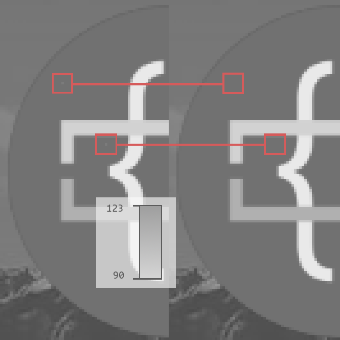
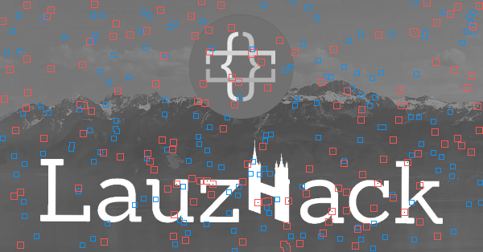

# SolomonTracker 🚚📦🔍

Welcome to the **SolomonTracker** repository – an 
innovative solution developed during [Lauzhack](https://lauzhack.com) 
2024. Powered by our team’s creativity and supported 
by LEGO pieces and the **BOBST Connect** platform, 
this project revolutionizes packaging sustainability 
and traceability. Built during a hackathon, 
SolomonTracker optimizes costs and promotes 
sustainability! 🌱

---

## 📦 What is SolomonTracker?

SolomonTracker is a conveyor-belt system integrated 
with **BOBST Connect** to trace and authenticate 
packaging during repackaging cycles. It uses 
**watermarked fingerprint codes** to mark each box, 
ensuring:

1. **Traceability:** Unique, secure fingerprint 
   codes track a box’s journey through the supply 
   chain.  

2. **Cost Optimization:** Ensures BOBST packaging 
   machines reuse boxes, reducing material waste.  

3. **Sustainability:** Promotes packaging reuse, 
   reducing environmental impact and enhancing 
   circularity.  

---

## 🛠 How do we do that?

We built SolomonTracker with **hardware innovation** 
and **secure algorithms**:

1. **Conveyor Belt Built with LEGO:** Using LEGO 
   components provided by BOBST, we built a conveyor 
   belt for automated packaging.  

2. **Integration with BOBST Connect:** The system 
   connects directly to BOBST Connect, enabling 
   seamless monitoring of the repackaging process.  

3. **Watermarking Fingerprint Code Generation:** 
   Using **Python** and random processes, we generate 
   unique watermark codes for each box.  
   - The codes are divided into regions and embedded 
     as images.  
   - Randomness ensures the codes remain untraceable 
     to malicious actors.
   - Here you can see the individual pixels changed to
     a greyscale image when a randomly chosen index gets
     a 1 bit (meaning add 10 to gray pixel value). The 0
     bits can't be seen since they don't change pixel value.

  

Following is a picture of the overlayed generated signatures by our bobstracker CLI app.

  

4. **Validation and Metrics:** SolomonTracker checks 
   that the same box is reused multiple times, 
   reducing material use and promoting sustainability.  

This system paves the way for a smarter, sustainable 
future in packaging.

---

Thank you for your interest in SolomonTracker! Let’s 
make packaging smarter and greener. 🌍🚀  
